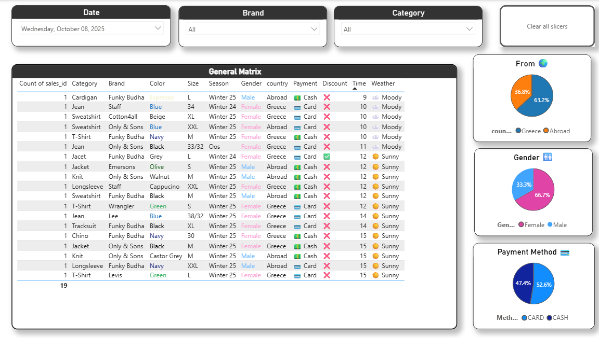

# Jean.gr Retail Analytics Project
This project simulates a real retail analytics environment for a fashion store, **Jean.gr**.  
It demonstrates how data can be collected, transformed, and analyzed to support business decisions using **SQL** and **Power BI**.

⚠️ All datasets used in this project are **fictional** and created solely for learning and demonstration purposes.

## 📊 Project Objectives  

- Build a **data pipeline** from Google Sheets to PostgreSQL and Power BI.  
- Design a clean **data model** to support reporting and performance insights.  
- Develop **interactive dashboards** for retail decision-making.  
- Demonstrate **ETL (Extract–Transform–Load)** and **data visualization** best practices. 


## 🗂️ Data Sources  

All raw data were stored in **Google Sheets** and include the following tables:

| Sheet Name | Description |
|-------------|-------------|
| **General Info** | Sales per day, time range, temperature, and weather. |
| **Customer** | Customer demographics and location (Greece or Abroad). |
| **Product** | Product details including brand, category, and size. |
| **Payment** | Payment method and discount information. |

Each sheet is published as a CSV endpoint and imported into PostgreSQL via COPY FROM PROGRAM (curl).

> ℹ️ The Google Sheets are **published as public CSV links**, which are automatically loaded into PostgreSQL through the [`refresh_from_sheets.sql`](./refresh_from_sheets.sql) script.  
> These public CSV endpoints ensure that anyone can **replicate the project** end-to-end without local files.

## 🗄️ Database Structure  

Database: **retail_project**  
Schema: **retail**

Scripts included in the project:

| Script | Description |
|--------|-------------|
| `01_create_schema.sql` | Creates database schema and base tables. |
| `02_staging_tables.sql` | Loads raw data from CSV files (staging layer). |
| `03_clean_views.sql` | Cleans and transforms data for analysis. |
| `04_fact_kpi_views.sql` | Creates KPI and analytical views. |
| `refresh_from_sheets.sql` | Refreshes the data whenever Google Sheets are updated. |

---

## 🧠 The Analysis

This section explains the design choices behind each SQL layer of the project:  
from raw ingestion via Google Sheets to a clean fact view (`retail.v_sales_fct`) consumed by Power BI.  
The focus is on data quality, consistency, and keeping all business logic in SQL — not in the BI layer.

---

### 1️⃣ Schema & Staging (`01_create_schema.sql`)

**Goal:**  
Create a clean structure (`retail` schema) and staging tables to safely store the raw CSVs imported from Google Sheets.

```sql
CREATE SCHEMA retail;
SET search_path TO retail, public;

CREATE TABLE retail.stg_general_info (
  sales_id     INTEGER,
  day          DATE,
  time         TEXT,
  temperature  NUMERIC,
  weather      TEXT
);

-- Verify table creation
SELECT * FROM retail.stg_general_info LIMIT 0;

-- Load data from Google Sheets (published as CSV)
TRUNCATE retail.stg_general_info;

COPY retail.stg_general_info (sales_id, day, time, temperature, weather)
FROM PROGRAM 'curl -sSL "https://docs.google.com/spreadsheets/d/e/2PACX-1vSajsHDqOE_iUmbsgYrQNdC9y1BjXlnqeS1w2qL8k5owlfYOycDEBJhlqFVRCmVuFvwSHWVRMp-VGJe/pub?gid=63291827&single=true&output=csv"'
WITH (FORMAT csv, HEADER true, DELIMITER ',', QUOTE '"', ESCAPE '"', ENCODING 'UTF8');

```

### 🗂️ 2. Staging Tables (`02_staging_tables.sql`) 

**Goal:**  
Create separate staging tables for each entity (Customer, Product, Sales, and Payment) to structure raw data before transformation.  
Each table represents a distinct data domain in the retail sales process.
```sql
CREATE TABLE retail.stg_customer (
  customer_id  INTEGER,
  gender       TEXT,
  age          INTEGER,
  country      TEXT
);

CREATE TABLE retail.stg_customer_sale (
  sales_id     INTEGER,
  customer_id  INTEGER
);

CREATE TABLE retail.stg_product (
  sale_id      INTEGER,    
  product_id   TEXT,
  category     TEXT,
  brand        TEXT,
  size         TEXT,
  color        TEXT,
  season       TEXT,
  discount_raw TEXT
);

CREATE TABLE retail.stg_payment (
  sales_id       INTEGER,
  payment_method TEXT
);

-- Verify table creation
SELECT 1 FROM retail.stg_customer      LIMIT 0;
SELECT 1 FROM retail.stg_customer_sale LIMIT 0;
SELECT 1 FROM retail.stg_product       LIMIT 0;
SELECT 1 FROM retail.stg_payment       LIMIT 0;

-- Load data from Google Sheets (published as CSV)

-- 1) CUSTOMER
TRUNCATE retail.stg_customer;
COPY retail.stg_customer (customer_id, gender, age, country)
FROM PROGRAM 'curl -sSL "https://docs.google.com/spreadsheets/d/e/2PACX-1vSajsHDqOE_iUmbsgYrQNdC9y1BjXlnqeS1w2qL8k5owlfYOycDEBJhlqFVRCmVuFvwSHWVRMp-VGJe/pub?gid=1121665675&single=true&output=csv"'
WITH (FORMAT csv, HEADER true, DELIMITER ',', QUOTE '"', ESCAPE '"', ENCODING 'UTF8');

-- 2) CUSTOMER SALE
TRUNCATE retail.stg_customer_sale;
COPY retail.stg_customer_sale (sales_id, customer_id)
FROM PROGRAM 'curl -sSL "https://docs.google.com/spreadsheets/d/e/2PACX-1vSajsHDqOE_iUmbsgYrQNdC9y1BjXlnqeS1w2qL8k5owlfYOycDEBJhlqFVRCmVuFvwSHWVRMp-VGJe/pub?gid=785230360&single=true&output=csv"'
WITH (FORMAT csv, HEADER true, DELIMITER ',', QUOTE '"', ESCAPE '"', ENCODING 'UTF8');

-- 3) PRODUCT
TRUNCATE retail.stg_product;
COPY retail.stg_product (sale_id, product_id, category, brand, size, color, season, discount_raw)
FROM PROGRAM 'curl -sSL "https://docs.google.com/spreadsheets/d/e/2PACX-1vSajsHDqOE_iUmbsgYrQNdC9y1BjXlnqeS1w2qL8k5owlfYOycDEBJhlqFVRCmVuFvwSHWVRMp-VGJe/pub?gid=0&single=true&output=csv"'
WITH (FORMAT csv, HEADER true, DELIMITER ',', QUOTE '"', ESCAPE '"', ENCODING 'UTF8');

-- 4) PAYMENT
TRUNCATE retail.stg_payment;
COPY retail.stg_payment (sales_id, payment_method)
FROM PROGRAM 'curl -sSL "https://docs.google.com/spreadsheets/d/e/2PACX-1vSajsHDqOE_iUmbsgYrQNdC9y1BjXlnqeS1w2qL8k5owlfYOycDEBJhlqFVRCmVuFvwSHWVRMp-VGJe/pub?gid=1786090900&single=true&output=csv"'
WITH (FORMAT csv, HEADER true, DELIMITER ',', QUOTE '"', ESCAPE '"', ENCODING 'UTF8');

-- Validate data load
SELECT COUNT(*) FROM retail.stg_customer;
SELECT COUNT(*) FROM retail.stg_customer_sale;
SELECT COUNT(*) FROM retail.stg_product;
SELECT COUNT(*) FROM retail.stg_payment;
``` 

### 🧹 3. Data Cleaning & Transformation (`03_clean_views.sql`) 

**Goal:**  
Transform all staging data into standardized, validated views for analytical use.  
This step ensures consistent naming, cleaned text fields, and properly formatted values (e.g. gender, country, payment type).

```sql
CREATE OR REPLACE VIEW retail.v_customer AS
SELECT
  customer_id,
  CASE
    WHEN lower(trim(gender)) IN ('m','male','άνδρας','ανδρας') THEN 'Male'
    WHEN lower(trim(gender)) IN ('f','female','γυναίκα','γυναικα') THEN 'Female'
    ELSE 'Other'
  END AS gender,
  age,
  CASE
    WHEN lower(trim(country)) IN ('greece', 'gr', 'ελλάδα', 'ελλαδα') THEN 'Greece'
    WHEN lower(trim(country)) IN ('abroad', 'εξωτερικο', 'εξωτερικό') THEN 'Abroad'
    ELSE NULL
  END AS country
FROM retail.stg_customer
WHERE customer_id IS NOT NULL;

-- Validation
SELECT DISTINCT country FROM retail.v_customer;
SELECT * FROM retail.v_customer LIMIT 5;
```
### 📊 4. Fact Table & KPI Views (`04_fact_kpi_views.sql`)

**Goal:**  
Combine all cleaned views (customer, product, general info, payment) into a single **fact table** for analysis in Power BI.  
This layer centralizes all business metrics and enables KPI aggregation per day, product, and customer.

---

```sql
CREATE OR REPLACE VIEW retail.v_customer_sale AS
SELECT 
  sales_id,
  customer_id
FROM retail.stg_customer_sale
WHERE sales_id IS NOT NULL 
  AND customer_id IS NOT NULL;
CREATE OR REPLACE VIEW retail.v_sales_fct AS
SELECT
  gi.sales_id,
  gi.day,
  gi.time_range,
  gi.temperature,
  gi.weather,
  cs.customer_id,
  c.gender,
  c.age,
  c.country,
  p.product_id,
  p.category,
  p.brand,
  p.size,
  p.color,
  p.season,
  p.has_discount,
  pay.payment_method
FROM retail.v_product p
LEFT JOIN retail.v_general_info gi ON gi.sales_id = p.sale_id
LEFT JOIN retail.v_customer_sale cs ON cs.sales_id = p.sale_id
LEFT JOIN retail.v_customer c       ON c.customer_id = cs.customer_id
LEFT JOIN retail.v_payment pay      ON pay.sales_id = p.sale_id;

-- Validation
SELECT COUNT(*) FROM retail.v_sales_fct;
SELECT * FROM retail.v_sales_fct LIMIT 10;
```

### 🔄 5. Automated Data Refresh (`refresh_from_sheets.sql`)

**Goal:**  
Automatically refresh all staging tables in PostgreSQL directly from **Google Sheets** (published as CSV).  
This allows live data updates — once new rows are added in Google Sheets, you simply re-run this script and then refresh Power BI.

---

```sql
-- REFRESH DATA FROM GOOGLE SHEETS  (run as superuser)

SET datestyle TO 'DMY';

-- 1️⃣ CUSTOMER
TRUNCATE retail.stg_customer;
COPY retail.stg_customer (customer_id, gender, age, country)
FROM PROGRAM 'curl -sSL "https://docs.google.com/spreadsheets/d/e/2PACX-1vSajsHDqOE_iUmbsgYrQNdC9y1BjXlnqeS1w2qL8k5owlfYOycDEBJhlqFVRCmVuFvwSHWVRMp-VGJe/pub?gid=1121665675&single=true&output=csv"'
WITH (FORMAT csv, HEADER true, DELIMITER ',', QUOTE '"', ESCAPE '"', ENCODING 'UTF8');

-- 2️⃣ CUSTOMER SALE
TRUNCATE retail.stg_customer_sale;
COPY retail.stg_customer_sale (sales_id, customer_id)
FROM PROGRAM 'curl -sSL "https://docs.google.com/spreadsheets/d/e/2PACX-1vSajsHDqOE_iUmbsgYrQNdC9y1BjXlnqeS1w2qL8k5owlfYOycDEBJhlqFVRCmVuFvwSHWVRMp-VGJe/pub?gid=785230360&single=true&output=csv"'
WITH (FORMAT csv, HEADER true, DELIMITER ',', QUOTE '"', ESCAPE '"', ENCODING 'UTF8');

-- 3️⃣ PRODUCT
TRUNCATE retail.stg_product;
COPY retail.stg_product (sale_id, product_id, category, brand, size, color, season, discount_raw)
FROM PROGRAM 'curl -sSL "https://docs.google.com/spreadsheets/d/e/2PACX-1vSajsHDqOE_iUmbsgYrQNdC9y1BjXlnqeS1w2qL8k5owlfYOycDEBJhlqFVRCmVuFvwSHWVRMp-VGJe/pub?gid=0&single=true&output=csv"'
WITH (FORMAT csv, HEADER true, DELIMITER ',', QUOTE '"', ESCAPE '"', ENCODING 'UTF8');

-- 4️⃣ GENERAL INFO
TRUNCATE retail.stg_general_info;
COPY retail.stg_general_info (sales_id, day, time, temperature, weather)
FROM PROGRAM 'curl -sSL "https://docs.google.com/spreadsheets/d/e/2PACX-1vSajsHDqOE_iUmbsgYrQNdC9y1BjXlnqeS1w2qL8k5owlfYOycDEBJhlqFVRCmVuFvwSHWVRMp-VGJe/pub?gid=63291827&single=true&output=csv"'
WITH (FORMAT csv, HEADER true, DELIMITER ',', QUOTE '"', ESCAPE '"', ENCODING 'UTF8');

-- 5️⃣ PAYMENT
TRUNCATE retail.stg_payment;
COPY retail.stg_payment (sales_id, payment_method)
FROM PROGRAM 'curl -sSL "https://docs.google.com/spreadsheets/d/e/2PACX-1vSajsHDqOE_iUmbsgYrQNdC9y1BjXlnqeS1w2qL8k5owlfYOycDEBJhlqFVRCmVuFvwSHWVRMp-VGJe/pub?gid=1786090900&single=true&output=csv"'
WITH (FORMAT csv, HEADER true, DELIMITER ',', QUOTE '"', ESCAPE '"', ENCODING 'UTF8');

-- Summary counts per table
SELECT 'stg_customer'        AS table, COUNT(*) FROM retail.stg_customer
UNION ALL
SELECT 'stg_customer_sale',  COUNT(*) FROM retail.stg_customer_sale
UNION ALL
SELECT 'stg_product',        COUNT(*) FROM retail.stg_product
UNION ALL
SELECT 'stg_general_info',   COUNT(*) FROM retail.stg_general_info
UNION ALL
SELECT 'stg_payment',        COUNT(*) FROM retail.stg_payment;

-- Quick validation samples
SELECT * FROM retail.stg_general_info ORDER BY sales_id LIMIT 5;
SELECT * FROM retail.stg_customer      LIMIT 5;
SELECT * FROM retail.stg_customer_sale LIMIT 5;
SELECT * FROM retail.stg_product       LIMIT 5;
SELECT * FROM retail.stg_payment       LIMIT 5;
```


## 📈 Power BI Dashboards  

The Power BI report is divided into several pages, each answering a specific business question:

| Page | Purpose |
|------|----------|
| **Year Overview** | High-level KPIs – total sales, customers, top categories. |
| **Previous Day Reports** | Compares sales and customer behavior day-to-day. |
| **Per Brand** | Highlights the performance of each brand. |
| **Does it worth it?** | Evaluates if opening earlier (9–10 AM) is profitable. |
| **Meet Our Typical Customer** | Identifies customer demographics and behavior. |
| **When Does It Pay to Have Staff?** | Finds the best weekday and hour combinations for staffing. |

---

## 🧮 DAX Measures & Calculated Columns  

Below are some of the key **DAX calculations** used across the dashboards:

| Measure / Column | Description |
|------------------|-------------|
| **Total Sales** = `COUNT('retail_v_sales_fct'[sales_id])` | Counts total sales transactions. |
| **Avg Sales per Customer** = `DIVIDE([Total Sales], DISTINCTCOUNT('retail_v_sales_fct'[customer_id]))` | Calculates the average number of sales per unique customer. |
| **Total Customers** = `DISTINCTCOUNT('retail_v_sales_fct'[customer_id])` | Total number of customers per selected period. |
| **Sales (9–10)** = `CALCULATE([Total Sales], 'retail_v_sales_fct'[time_range] = "9-10")` | Filters total sales during the 9–10 AM slot. |
| **Days with NO Sales (9–10)** = `CALCULATE(DISTINCTCOUNT('retail_v_sales_fct'[day]), [Sales (9–10)] = 0)` | Counts how many days had no sales in the 9–10 AM range. |
| **DayOfWeek** = `FORMAT('retail_v_sales_fct'[day], "dddd")` | Converts date to weekday name for weekly analysis. |
| **HourOrder** = `VALUE(LEFT('retail_v_sales_fct'[time_range], FIND("-", 'retail_v_sales_fct'[time_range]) - 1))` | Extracts the first hour from the time range for sorting. |
| **Avg Temperature** = `AVERAGE('retail_v_sales_fct'[temperature])` | Calculates average daily temperature. |
| **Avg Weather Condition** = `SELECTEDVALUE('retail_v_sales_fct'[weather])` | Returns the dominant weather type for the selected day/time. |

📌 *These DAX measures support key visuals such as:*
- Sales per Hour & Avg Sales per Customer (Combo chart)
- “Does it worth it?” early opening analysis
- Weather & Sales correlation table
- Typical Customer demographics card
- Best Day/Hour for staffing visualization

## 📊 Power BI Dashboard Pages

Below are the main report pages included in this project — each one answers a specific business question using data-driven insights.

### 🗓️ Year Overview
> High-level view of total sales, customer count, and key KPIs across the full period.

- Visuals: KPI cards, brand/category bar charts, overall trends.
- Goal: Understand general store performance at a glance.


### 📅 Previous Day 1 & 2
> Compare daily performance metrics — how did sales and customer count change day-to-day?

- Visuals: Line chart for trend comparison, KPIs vs previous day.
- Goal: Quickly spot changes or anomalies in sales volume.




### 🧥  Brand
> Evaluate which brands perform best and contribute most to total sales.

- Visuals: Bar & pie charts by category and brand.
- Goal: Identify top-selling brands and underperformers for stock & marketing planning.


### ⏰ Is it worth it?
> “Is it profitable to open at 9 AM?” — analyze early morning performance vs total.

- Visuals: Cards for total sales, days active, no-sales days (9–10), weather impact table.
- Goal: Decide whether keeping the store open early adds business value.


### 👥 Meet Our Typical Customer
> Understand who your average customer is — demographics and behavior.

- Visuals: Gender/age pie charts, sales by country, average spend metrics.
- Goal: Create targeted online ads for your main audience.


### 👔 When Does It Pay to Have Staff?
> Find the best days and hours for staffing based on sales distribution.

- Visuals: Heatmap of weekday vs time range, total sales overlay.
- Goal: Schedule employees efficiently — when sales are highest.


### 🧥 Product Performance
> Explore how each product performs across different demographics, time slots, and conditions.

- Visuals: Sales by Age, Sales by Time, Gender Distribution, Product Color Analysis, Payment Method, and Discount Ratio.
- Goal: Identify which products perform best under specific conditions — such as customer demographics, time of purchase, and discount influence.
- Features: Interactive slicers for Category, Brand, and Product enable detailed filtering for product-level insights.


## 🔄 Data Refresh Process  

1. Update data in the Google Sheets files.  
2. Run the refresh script in the SQL terminal:  
   ```bash
   psql -U postgres -d retail_project -f refresh_from_sheets.sql
3. Refresh the dataset in Power BI to pull the new data.

## 🧠 Key Insights & Learning Outcomes

- Data pipeline creation using PostgreSQL and Power BI.

- Data cleaning, transformation, and model design.

- DAX measures and calculated columns for business KPIs.

- Dashboard storytelling for real-world retail use cases.


## 🧰 Tech Stack

- **Database:** PostgreSQL  
- **Data Source:** Google Sheets (live CSV link)  
- **Visualization:** Power BI  
- **Tools:** VS Code, pgAdmin 4


## 🏁 Conclusion

The **Jean.gr Retail Analytics Project** demonstrates how a small business can leverage data to make smarter, data-driven decisions — without expensive infrastructure.

By combining **Google Sheets**, **PostgreSQL**, and **Power BI**, this project builds a fully functional analytics pipeline:
- Data is entered and updated in a familiar environment (Google Sheets).  
- It is then cleaned, validated, and structured through SQL in PostgreSQL.  
- Finally, Power BI visualizes actionable insights for store performance, customer behavior, and operational optimization.

The project highlights how even simple, everyday retail data can be transformed into valuable business intelligence.

> 💡 This work reflects an iterative learning process — the model continues to evolve with every new idea, metric, or visualization added.

**Thank you for viewing this project!**  
If you found it useful or inspiring, feel free to ⭐ star it or connect with me for collaboration.

